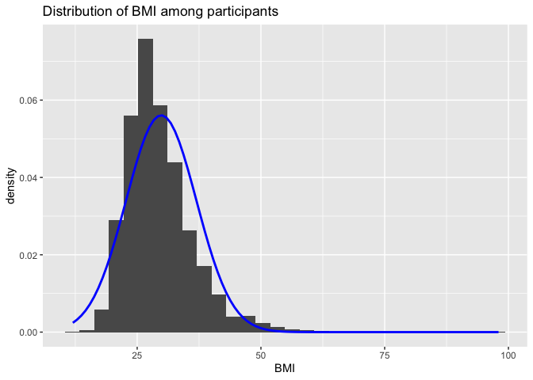
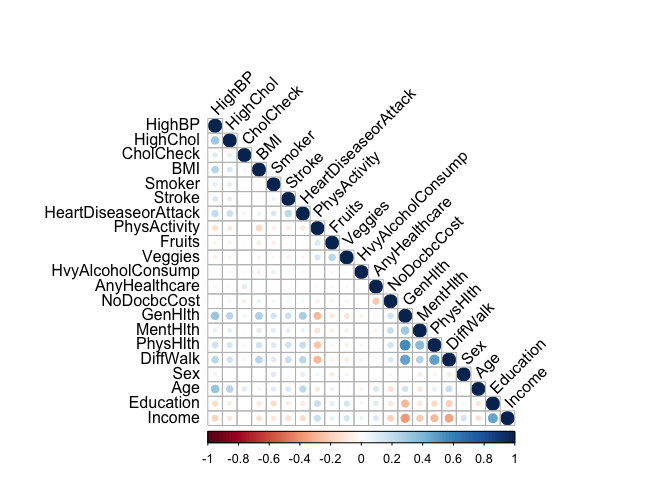
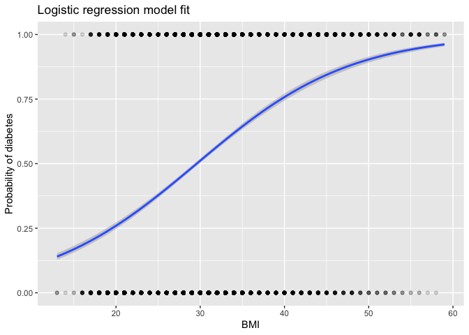
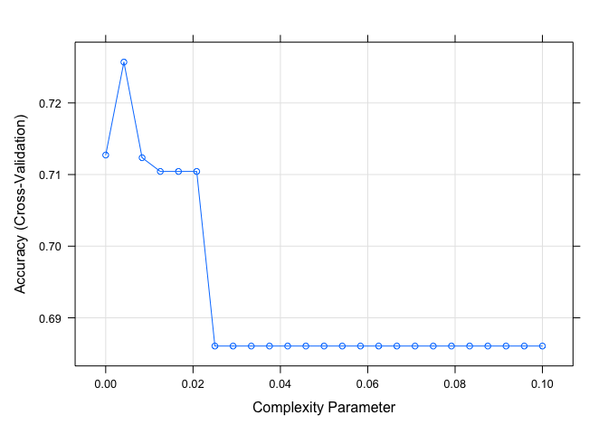
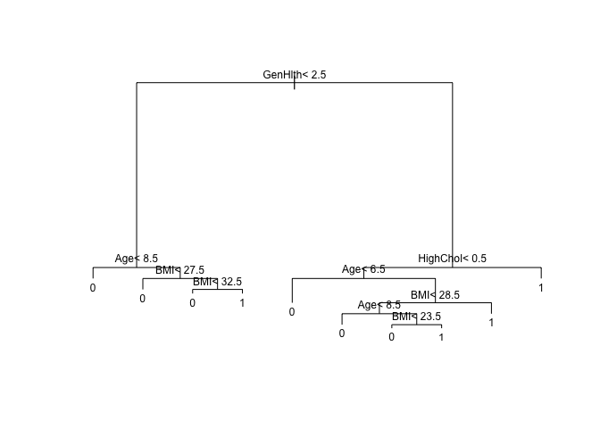

yifan_final
================
Yifan Duan
2022-12-06

``` r
library(tidyverse)
```

    ## ── Attaching packages ─────────────────────────────────────── tidyverse 1.3.2 ──
    ## ✔ ggplot2 3.4.0      ✔ purrr   0.3.5 
    ## ✔ tibble  3.1.8      ✔ dplyr   1.0.10
    ## ✔ tidyr   1.2.1      ✔ stringr 1.4.1 
    ## ✔ readr   2.1.3      ✔ forcats 0.5.2 
    ## ── Conflicts ────────────────────────────────────────── tidyverse_conflicts() ──
    ## ✖ dplyr::filter() masks stats::filter()
    ## ✖ dplyr::lag()    masks stats::lag()

``` r
library(corrplot)
```

    ## corrplot 0.92 loaded

``` r
library(caret)
```

    ## Loading required package: lattice
    ## 
    ## Attaching package: 'caret'
    ## 
    ## The following object is masked from 'package:purrr':
    ## 
    ##     lift

``` r
df <- read.csv("diabetes_5050.csv", sep = ",", header = TRUE)
```

``` r
df |>
  ggplot() +
  geom_histogram(aes(x = BMI, y = ..density..)) + 
  labs(x = "BMI", title = "Distribution of BMI among participants") +
  stat_function(fun = dnorm, args = list(mean = mean(df$BMI), sd = sd(df$BMI)), lwd = 1, col = "blue")
```

    ## Warning: Using `size` aesthetic for lines was deprecated in ggplot2 3.4.0.
    ## ℹ Please use `linewidth` instead.

    ## Warning: The dot-dot notation (`..density..`) was deprecated in ggplot2 3.4.0.
    ## ℹ Please use `after_stat(density)` instead.

    ## `stat_bin()` using `bins = 30`. Pick better value with `binwidth`.

<!-- -->

``` r
df_cor = cor(df[, c(2:22)], method = "pearson")
corrplot(df_cor, method = "circle", type = "lower", tl.col = "black", tl.srt = 45)
```

<!-- -->

``` r
# removing variables that appears collinear with other variables
df <- df |> filter(BMI < 60) |> dplyr::select(-c(MentHlth, PhysHlth, DiffWalk, Education, Income, HighBP))
```

Splitting the data

``` r
y <- df$Diabetes_binary
test_index <- createDataPartition(y, times = 1, p = 0.2, list = FALSE)

test_set <- df[test_index,]
train_set <- df[-test_index,]
```

``` r
fit_glm <- glm(Diabetes_binary ~ ., data = train_set, family = "binomial")
p_hat_glm <- predict(fit_glm, test_set, type="response")
y_hat_glm <- factor(ifelse(p_hat_glm > 0.5, 1, 0))
confusionMatrix(y_hat_glm, as.factor(test_set$Diabetes_binary))$overall["Accuracy"]
```

    ##  Accuracy 
    ## 0.7398622

``` r
ggplot(aes(x = BMI, y = Diabetes_binary), data = test_set) +
  geom_point(alpha = .15) + 
  geom_smooth(method = "glm", method.args = list(family = "binomial")) +
  ggtitle("Logistic regression model fit") +
  xlab("BMI") +
  ylab("Probability of diabetes")
```

    ## `geom_smooth()` using formula = 'y ~ x'

<!-- -->

``` r
summary(fit_glm)
```

    ## 
    ## Call:
    ## glm(formula = Diabetes_binary ~ ., family = "binomial", data = train_set)
    ## 
    ## Deviance Residuals: 
    ##     Min       1Q   Median       3Q      Max  
    ## -2.9469  -0.8410  -0.1225   0.8700   2.9703  
    ## 
    ## Coefficients:
    ##                       Estimate Std. Error z value Pr(>|z|)    
    ## (Intercept)          -8.051785   0.128648 -62.588  < 2e-16 ***
    ## HighChol              0.693533   0.020591  33.682  < 2e-16 ***
    ## CholCheck             1.444589   0.090997  15.875  < 2e-16 ***
    ## BMI                   0.095433   0.001791  53.277  < 2e-16 ***
    ## Smoker                0.019922   0.020705   0.962   0.3359    
    ## Stroke                0.263955   0.045531   5.797 6.74e-09 ***
    ## HeartDiseaseorAttack  0.306270   0.031409   9.751  < 2e-16 ***
    ## PhysActivity         -0.045051   0.023284  -1.935   0.0530 .  
    ## Fruits               -0.055751   0.021678  -2.572   0.0101 *  
    ## Veggies              -0.115420   0.025661  -4.498 6.87e-06 ***
    ## HvyAlcoholConsump    -0.753891   0.053931 -13.979  < 2e-16 ***
    ## AnyHealthcare        -0.046591   0.052094  -0.894   0.3711    
    ## NoDocbcCost           0.062817   0.036984   1.698   0.0894 .  
    ## GenHlth               0.629703   0.010882  57.864  < 2e-16 ***
    ## Sex                   0.229676   0.020683  11.104  < 2e-16 ***
    ## Age                   0.195424   0.004145  47.151  < 2e-16 ***
    ## ---
    ## Signif. codes:  0 '***' 0.001 '**' 0.01 '*' 0.05 '.' 0.1 ' ' 1
    ## 
    ## (Dispersion parameter for binomial family taken to be 1)
    ## 
    ##     Null deviance: 78079  on 56321  degrees of freedom
    ## Residual deviance: 58745  on 56306  degrees of freedom
    ## AIC: 58777
    ## 
    ## Number of Fisher Scoring iterations: 5

``` r
control <- trainControl(method = "cv", number = 10, p = .9)
train_rpart <- train(as.factor(Diabetes_binary) ~ .,
                     method = "rpart",
                     tuneGrid = data.frame(cp = seq(0.0, 0.1, len = 25)),
                     data = train_set, trControl = control)
plot(train_rpart)
```

<!-- -->

``` r
y_hat <- predict(train_rpart, test_set)
confusionMatrix(y_hat, as.factor(test_set$Diabetes_binary))$overall["Accuracy"]
```

    ##  Accuracy 
    ## 0.7234571

``` r
plot(train_rpart$finalModel, margin = 0.01)
text(train_rpart$finalModel, cex = 0.75)
```

<!-- -->
